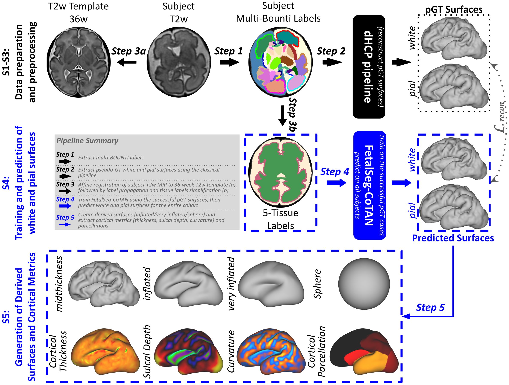
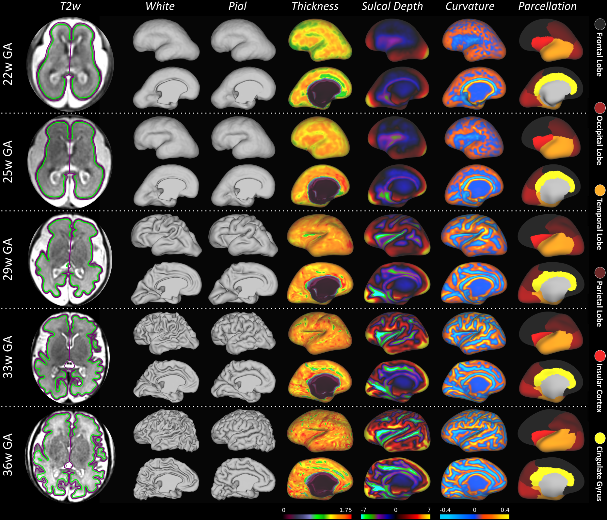

# FetalSeg-CoTAN

## Overview
FetalSeg-CoTAN is a deep learning framework that reconstructs fetal white matter and pial cortical surfaces directly from tissue segmentation labels.
The network was trained using fetal Multi-BOUNTI labels [1] (Step 1 in figure below), 
where pseudo-GT surfaces were extracted using the fetal-adapted classical surface reconstruction pipeline [2]  (Step 2 in figure below).
This repository contains the code to:
1. Preprocess your fetal data to be affinely aligned to the 36-week T2w fetal brain atlas (see: templates/dhcp_fetal_week36_t2w.nii.gz) and in its 5-tissue labels simplfied form (Step 3 in figure below).
2. Do inference on the preprocessed data to obtain surfaces (Step 4 in figure below).
3. Postproces the predicted surfaces to obtain inflated surfaces, metrics and cortical parcellations (Step 5 in figure below) 

More details about this piece of work can be found at [3] [link to paper / TBD].



Below you can see 5 example subjects at 22, 25, 29, 33, and 36 weeks gestational age (GA).
For each subject, the reconstructed white matter (green) and pial (purple) boundaries are overlaid 
on top of the mid-brain axial slice of their respective native T2w image, 
followed by the reconstructed white and pial surfaces for the left hemisphere.
Cortical thickness, sulcal depth, mean curvature, and the cortical parcellation maps are displayed
on the corresponding inflated surfaces.


## Example usage

### Preprocessing your data
Assuming your data is in ```MAIN_DATA_FOLDER/```

```
MAIN_DATA_FOLDER/
├── fetal-subjects.tsv
└── input-orig/
    ├── [SUBJ1]
        ├── [SUBJ1]_LAB43_brain.nii.gz
        └── [SUBJ1]_T2w.nii.gz
    └── [SUBJ2]
        ├── [SUBJ2]_LAB43_brain.nii.gz
        └── [SUBJ2]_T2w.nii.gz
```
where: ```fetal-subjects.tsv``` has the following header:
```
participant_id  session_id      scan_age
CC00001XX01       1000          25.0
CC00001XX02       3000          32.0
```
such that ```[SUBJ1]=sub-CC00001XX01_ses-1000``` and ```[SUBJ2]=sub-CC00001XX02_ses-3000```.

Go to ```preprocessing/``` and run the following command:
```
bash multi_preprocess_subject.sh PATH/TO/TSV PATH/TO/FOLDER_INPUT PATH/TO/FOLDER_OUTPUT
```
This will do the following:

1) Create simplified multi-bounti labels and brain mask
2) Register original T2w image to T2w template and apply the transformation to the labels

Your folder will now look like this:
```
MAIN_DATA_FOLDER/
├── fetal-subjects.tsv
├── input-orig/
    ├── [SUBJ1]
        ├── [SUBJ1]_brain-mask.nii.gz           ## this is new (brain mask)
        ├── [SUBJ1]_LAB43_brain.nii.gz
        ├── [SUBJ1]_LAB_brain.nii.gz            ## this is new (simplified labels)
        └── [SUBJ1]_T2w.nii.gz
    └── [SUBJ2] ...
└── input-aff/                                  ## this is new (the output folder)
    ├── preprocessing-failed.tsv                ## Logs failed cases
    ├── preprocessing-success.tsv               ## Logs succesful cases
    ├── [SUBJ1]
        ├── [SUBJ1]_affine_0GenericAffine.mat   ## this is new (the affine matrix)
        ├── [SUBJ1]_LAB43_brain_affine.nii.gz   ## this is new (the affinely aligned multi bounti labels)
        ├── [SUBJ1]_LAB_brain_affine.nii.gz     ## this is new (the affinely aligned simplified labels)
        └── [SUBJ1]_T2w_affine.nii.gz           ## this is new (the affinely aligned T2w image)
    └── [SUBJ2] ...   
```

### Running inference
Assuming your data is in ```MAIN_DATA_FOLDER/input-aff/``` as shown above,
navigate to the **FetalSeg-CoTAN root directory** (or project root) and run the following command:
```
python -m predict-fetal \
          --tsv_file_subjects="/PATH/TO/fetal-subjects.tsv" \
          --results_file="fetal-metrics.csv" \
          --logs_file="fetal-logs.csv" \
          --templates_path="templates/" \
          --orig_t2w_path="MAIN_DATA_FOLDER/input-orig/" \
          --orig_lab_path="MAIN_DATA_FOLDER/input-orig/" \
          --affine_label_path="MAIN_DATA_FOLDER/input-aff/" \
          --output_path="MAIN_DATA_FOLDER/output/" \
          --device="cuda" \
          --do_spheres --do_rois --keep_intermediates 
```
The last three parameters ```--do_spheres --do_rois --keep_intermediates``` 
you can omit if you want only surfaces without spheres and without the cortical parcellation.

After a succesful run, your folder will look like this:
```
MAIN_DATA_FOLDER/
├── fetal-subjects.tsv
├── input-orig/
    ├── [SUBJ1]
        ├── ...
        └── [SUBJ1]_T2w.nii.gz
    └── ...
├── input-aff/                                  
    ├── preprocessing-failed.tsv           
    ├── preprocessing-success.tsv            
    ├── [SUBJ1]
        ├── ...
        ├── [SUBJ1]_LAB_brain_affine.nii.gz
        └── [SUBJ1]_T2w_affine.nii.gz
    └── ...   
└── output/                                     ## This is new
    ├── fetal-logs.csv                          ## Stores fetal logs
    ├── fetal-metrics.csv                       ## Stores average per hemisphere fetal metrics            
    ├── [SUBJ1]        
        ├── [SUBJ1]_pred_[left/right]_[white/pial/midthickness[.surf.gii    ## surfaces for each hemisphere
        ├── [SUBJ1]_pred_[left/right]_[curv/sulc/thickness].shape.gii       ## metrics for each hemisphere
        ├── [SUBJ1]_pred_[left/right]_[sphere/inflated/vinflated].surf.gii  ## inflated surfaces for each hemisphere (if --do_sphere set)
        ├── [SUBJ1]_pred_[left/right]_roi.shape.gii                         ## cortical binary  mask (if --do_rois set)
        ├── [SUBJ1]_pred_[left/right]_rois.label.gii                        ## cortical parcellation (if --do_rois set)
        ├── [SUBJ1]_pred_[left/right]_[rois_filled/rois_cleaned].label.gii  ## cleaned-up cortical parcellations (if --keep_intermediates set, otherwise overwrites rois.label.gii)
        ├── [SUBJ1]_LAB43_brain.nii.gz                                      ## the original/native multi-bounti labels
        └── [SUBJ1]_T2w.nii.gz                                              ## the original/native T2w image
    └── [SUBJ2]
        └── ...
```

## Related Repositories

### Associated Repository
The following repository is part of my work for MIDL 2026 if you would like to check it out:
1. SuD-CoTAN - [https://github.com/irinagrigorescu/SuDCoTAN](https://github.com/irinagrigorescu/SuDCoTAN)

### Acknowledgements
The following repositories were not only of great inspiration, but have also helped make this work possible.
Please do check them out:
1. CoTAN - [https://github.com/m-qiang/CoTAN](https://github.com/m-qiang/CoTAN)
2. CoSEG - [https://github.com/m-qiang/CoSeg](https://github.com/m-qiang/CoSeg)

## Bibliography:
1. Multi-BOUNTI: Multi-lobe Brain vOlUmetry and segmeNtation for feTal and neonatal MRI (Uus et al., 2026) [https://doi.org/10.64898/2026.04.21.26351376](https://doi.org/10.64898/2026.04.21.26351376)
2. fetalsvrtk/surface:multi_bounti_2026 [https://hub.docker.com/r/fetalsvrtk/surface](https://hub.docker.com/r/fetalsvrtk/surface)
3. FetalSegCoTAN ... [TBD]

